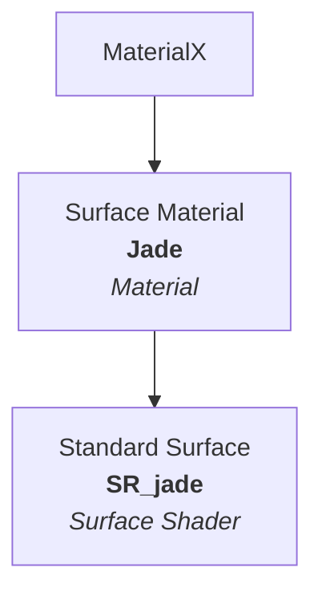
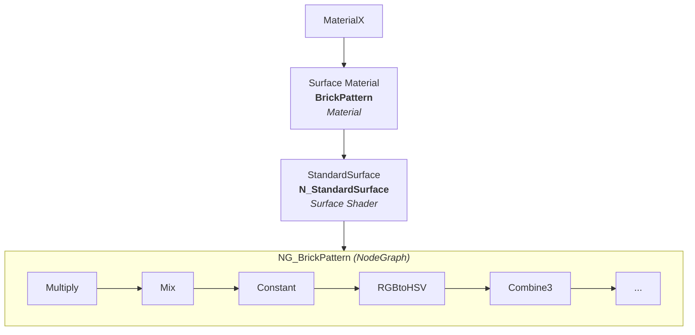

# What is MaterialX

- [MaterialX Website](http://www.materialx.org/)
- [Specification](https://github.com/AcademySoftwareFoundation/MaterialX/tree/b26f19e75226163acea0e24b457e3d4649e04b64/documents/Specification) (Version 1.39 (preview))

What it is conceptually (according to Copilot):

> MaterialX is an open standard for representing materials and shading networks in computer graphics.
> It was developed by Lucasfilm's Advanced Development Group and released as open source in 2012.
> MaterialX is designed to be a flexible and extensible format that can be used to describe materials for a wide range of rendering engines and applications.

What it is technically (according to Copilot):

> It is based on a node graph representation of materials, where nodes represent functions that take input values and produce output values.
> MaterialX includes a set of standard nodes that can be used to describe common material properties such as color, roughness, and metalness.
> It also supports the creation of custom nodes, allowing artists and developers to define new material properties and effects.

What it is in usage (according to Copilot):

> MaterialX is designed to be platform-independent and can be used with a variety of programming languages and rendering engines.
> It is supported by a number of commercial and open source tools, including Autodesk Maya, Foundry's Katana, and Pixar's RenderMan.
> MaterialX is also integrated into the Universal Scene Description (USD) format, allowing materials to be shared between different applications and rendering engines.

What it is in relation to glTF (according to Copilot):

> MaterialX and glTF are two complementary technologies that are commonly used together in the field of computer graphics.
> MaterialX provides a standardized way to define and manage materials, while glTF ensures efficient transmission and rendering of these materials in real-time applications.
> glTF supports Physically Based Rendering (PBR) materials, which are commonly defined using MaterialX.
> MaterialX contains a set of standard nodes that match the PBR materials defined in the glTF specification, making it easy to convert between the two formats.

## What does a MaterialX file look like?

A MTLX file is a XML file.
It describes a material using a set of nodes and connections.

All XML nodes have a `name` attribute.
It is a unique identifier in the scope, i.e. all elements with the same parent must have different names.

### Standard surface example

This is a simple example ([`standard_surface_jade.mtlx`](https://github.com/AcademySoftwareFoundation/MaterialX/blob/b26f19e75226163acea0e24b457e3d4649e04b64/resources/Materials/Examples/StandardSurface/standard_surface_jade.mtlx)):

```xml
<?xml version="1.0"?>
<materialx version="1.39" colorspace="lin_rec709">
  <standard_surface name="SR_jade" type="surfaceshader">
    <input name="base" type="float" value="0.5" />
    <input name="base_color" type="color3" value="0.0603, 0.4398, 0.1916" />
    <!-- etc. -->
  </standard_surface>
  <surfacematerial name="Jade" type="material">
    <input name="surfaceshader" type="surfaceshader" nodename="SR_jade" />
  </surfacematerial>
</materialx>
```

It is structured like this:



### Standard surface procedural example

[`standard_surface_brick_procedural.mtlx`](https://github.com/AcademySoftwareFoundation/MaterialX/blob/b26f19e75226163acea0e24b457e3d4649e04b64/resources/Materials/Examples/StandardSurface/standard_surface_brick_procedural.mtlx) on the other hand is a procedural material, which contains a `nodegraph`.



## Ecosystem

### PBR

- [OpenPBR](https://academysoftwarefoundation.github.io/OpenPBR/) is "a surface shading model"

### Open `mtlx` files

- The [MaterialX](https://github.com/AcademySoftwareFoundation/MaterialX) repo contains a simple graph viewer/editor
- [QuiltiX](https://github.com/PrismPipeline/QuiltiX) is "a graphical node editor to edit, and author MaterialX based materials of 3D assets"
- Bevy: Soon™

### Writing MaterialX files

- Blender: Soon™
